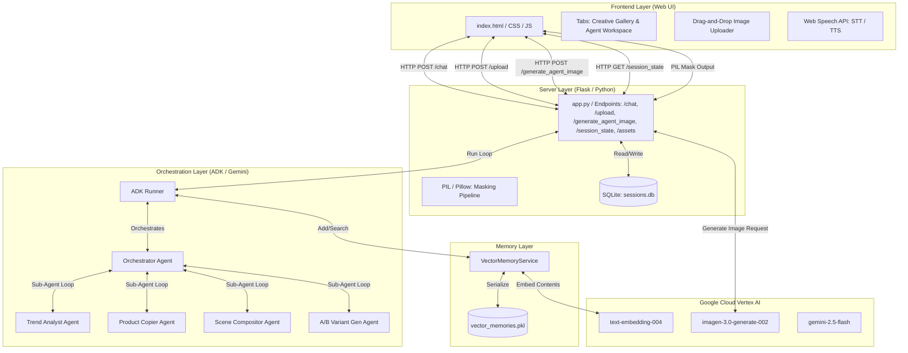
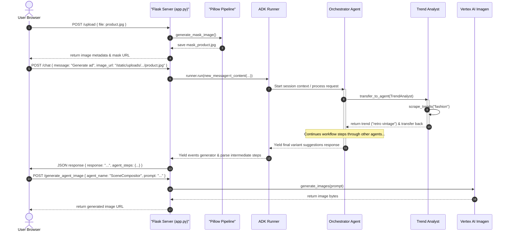

# AI Open-Word Asset Factory (Ad Visualizer) Architecture

This document describes the high-level architecture, component layers, multi-agent orchestration, and data flow of the AI Open-Word Asset Factory system.



---

## 1. Architectural Layers

### A. Frontend Layer (Web UI)
* **Structure:** [templates/index.html](file:///home/devstar9515/way-back-home/advisualizer/templates/index.html) provides a clean, responsive layout built using Bootstrap 5 and custom glassmorphic styling.
* **Tabs Interface:** Includes two primary tabs:
  * **Creative Gallery:** Displays the uploaded product thumbnails and generated campaign assets. Clicking an uploaded product highlights it as active.
  * **Agent Workspace:** Displays all four sub-agents, their active strategies, prompts, and strategy-to-image preview generation elements.
* **Upload Zone:** A drag-and-drop / file selector zone for adding product images to the session.
* **Controller:** [static/app.js](file:///home/devstar9515/way-back-home/advisualizer/static/app.js) handles:
  * Uploading files to `/upload` and selecting/highlighting products.
  * Communicating with the `/chat` endpoint and automatically switching to the Agent Workspace tab when strategies are generated.
  * Triggering dynamic strategy-to-image preview generations via `/generate_agent_image`.
  * Toggling Text-to-Speech (TTS) for agent replies and Speech-to-Text (STT) for user inputs.
  * Restoring session state on page load by calling `/session_state`.
* **Styling:** [static/style.css](file:///home/devstar9515/way-back-home/advisualizer/static/style.css) utilizes Outfit & Plus Jakarta Sans typography, custom neon accents, custom tab stylings, and agent-specific badge highlight themes.

### B. Server Layer (Flask)
* **Controller:** [app.py](file:///home/devstar9515/way-back-home/advisualizer/app.py) runs the Flask backend, hosting:
  * `/` : Serves the dashboard index template.
  * `/upload` (POST) : Saves product images in session folders and invokes the Pillow pipeline to save a black-and-white edge mask.
  * `/chat` (POST) : Passes the prompt and optional image context to the ADK `Runner`, parses intermediate tool outputs to build structured `agent_steps`, and saves them to the session.
  * `/generate_agent_image` (POST) : Invokes Vertex AI Imagen 3 to generate images based on agent strategy prompts and stores them in the session's gallery.
  * `/session_state` (GET) : Retrieves persistent uploaded products and agent workspace states.
  * `/assets` (GET) : Fetches creative assets list and uploaded images.
* **Image Processing:** Uses Pillow (`PIL`) to generate high-contrast edge masks (`generate_mask_image`).
* **Database:** SQLite (`sessions.db`) stores user session data under a JSON schema:
  ```json
  {
      "uploaded_images": [{"name": "file.jpg", "url": "/static/uploads/.../file.jpg", "mask_url": "..."}],
      "agent_steps": {
          "TrendAnalyst": {"name": "...", "strategy": "...", "prompt": "...", "image_url": "..."},
          "ProductCopier": {"name": "...", "strategy": "...", "prompt": "...", "image_url": "..."},
          "SceneCompositor": {"name": "...", "strategy": "...", "prompt": "...", "image_url": "..."},
          "ABVariantGenerator": {"name": "...", "strategy": "...", "prompts": [...], "images": {...}}
      },
      "creative_assets": [{"id": "...", "name": "...", "url": "..."}]
  }
  ```

### C. Orchestration Layer (Google ADK)
Managed in [memory.py](file:///home/devstar9515/way-back-home/advisualizer/memory.py), the `Runner` coordinates a tree of specialized Google Agent Development Kit (ADK) `LlmAgent` instances:
1. **Orchestrator Agent:** The core controller that decides how to delegate tasks to sub-agents. It uses the `gemini-2.5-flash` model and is instructed to follow a strict sequential flow:
   $$\text{Trend Analysis} \rightarrow \text{Product Analysis} \rightarrow \text{Scene Composition} \rightarrow \text{Variant Generation}$$
2. **Trend Analyst:** Identifies visual and style trends (e.g., minimalist pastel, neon cyberpunk) using the `scrape_trends` tool.
3. **Product Copier:** Generates structural masks or background removal strategy (e.g., alpha matting) via the `analyze_product_image` tool.
4. **Scene Compositor:** Synthesizes structured image generator backdrop prompts using `generate_backdrop_prompt`.
5. **A/B Variant Generator:** Adapts the base backdrop prompt with distinct lighting, aspect ratios, and Call-to-Action (CTA) overlays via the `create_variants` tool.

### D. Memory & Embeddings Layer
* **Embedding Model:** Uses `text-embedding-004` to create vector representation of session history turns.
* **Vector Memory:** Implements `VectorMemoryService` that inherits from `BaseMemoryService`:
  * `add_session_to_memory`: Embeds the last turn's text and appends it to a list.
  * `search_memory`: Performs cosine similarity (dot product of normalized embeddings) between the query embedding and the stored memories to retrieve the top 5 most relevant context matches.
  * **Serialization:** Serialized to [vector_memories.pkl](file:///home/devstar9515/way-back-home/advisualizer/vector_memories.pkl) locally.

---

## 2. Dynamic Workflow & Message Flow



1. The user uploads a product image which goes to `/upload`.
2. Flask saves the original and triggers the Pillow pipeline to construct an outline mask for the **Product Copier**.
3. When the user asks to generate a campaign, the request (with active product context) is POSTed to `/chat`.
4. The Flask handler wraps the text in `t_content` and submits it to the `Runner`.
5. The `Runner` wakes up the **Orchestrator Agent**, which retrieves semantic context via `VectorMemoryService.search_memory`.
6. The Orchestrator delegates the request in sequence to the specialized sub-agents.
7. Flask consumes the generator, intercepts intermediate tool calls/responses, updates the session's `agent_steps`, and returns them to the frontend.
8. The user clicks **"Generate Image"** in the **Agent Workspace** tab, which invokes `/generate_agent_image` to trigger Imagen 3 generation and append the new asset to the creative library.
