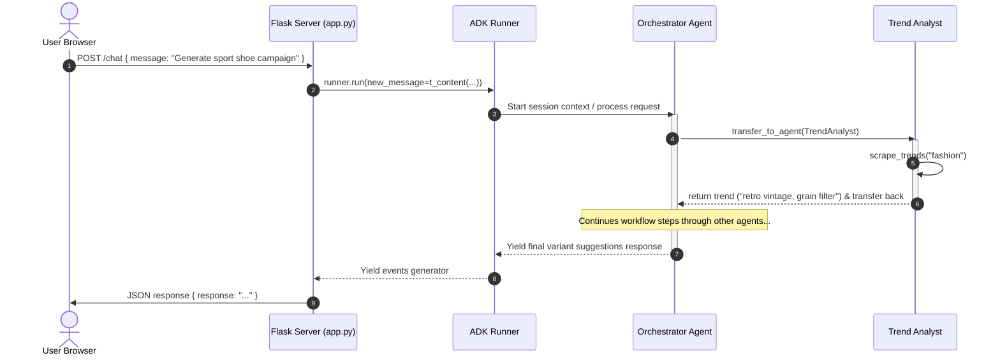

# AI Open-Word Asset Factory (Ad Visualizer) Architecture

This document describes the high-level architecture, component layers, multi-agent orchestration, and data flow of the AI Open-Word Asset Factory system.

```mermaid
graph TB
    subgraph Frontend Layer (Web UI)
        UI[index.html / CSS / JS]
        Audio[Web Speech API: STT / TTS]
    end

    subgraph Server Layer (Flask)
        API[app.py / Endpoints]
        DB[(SQLite: sessions.db)]
    end

    subgraph Orchestration Layer (ADK / Gemini)
        Run[ADK Runner]
        Orch[Orchestrator Agent]
        TA[Trend Analyst Agent]
        PC[Product Copier Agent]
        SC[Scene Compositor Agent]
        AB[A/B Variant Gen Agent]
    end

    subgraph Memory & Embeddings Layer
        VM[VectorMemoryService]
        PKL[(vector_memories.pkl)]
        Embed[text-embedding-004]
    end

    UI <-->|HTTP POST /chat| API
    API <-->|Run Loop| Run
    API <-->|Read/Write| DB
    Run <-->|Orchestrates| Orch
    Orch <-->|Sub-Agent Loop| TA
    Orch <-->|Sub-Agent Loop| PC
    Orch <-->|Sub-Agent Loop| SC
    Orch <-->|Sub-Agent Loop| AB
    Run <-->|Add/Search| VM
    VM <-->|Serialize| PKL
    VM <-->|Embed Contents| Embed
```

---

## 1. Architectural Layers

### A. Frontend Layer (Web UI)
* **Structure:** [templates/index.html](file:///home/sanjeev_mehrotra/advisualizer/templates/index.html) provides a clean, responsive layout built using Bootstrap 5 and custom glassmorphic styling.
* **Styling:** [static/style.css](file:///home/sanjeev_mehrotra/advisualizer/static/style.css) utilizes Outfit & Plus Jakarta Sans typography, custom neon accents (cyan, pink, purple), scrollbars, and dynamic message card animations.
* **Controller:** [static/app.js](file:///home/sanjeev_mehrotra/advisualizer/static/app.js) handles:
  * Sending user chat queries to `/chat` and displaying chat bubbles.
  * Toggling Text-to-Speech (TTS) for agent vocal replies.
  * Capturing vocal input using Speech-to-Text (STT) via the browser's Web Speech API (`webkitSpeechRecognition`).
  * Coordinating the **Agent Flow Tracker** visually as the active stage progresses.

### B. Server Layer (Flask)
* **Controller:** [app.py](file:///home/sanjeev_mehrotra/advisualizer/app.py) runs a lightweight Flask server serving:
  * `/` : The dashboard index template.
  * `/chat` (POST) : Passes the user input to the ADK `Runner` and returns the concatenated generator output back to the client.
  * `/assets` (GET) : Fetches metadata of generated variant assets stored locally in the static folder.
* **Database:** Uses SQLite (`sessions.db`) to persist basic session metadata.

### C. Orchestration Layer (Google ADK)
Managed in [memory.py](file:///home/sanjeev_mehrotra/advisualizer/memory.py), the `Runner` coordinates a tree of specialized Google Agent Development Kit (ADK) `LlmAgent` instances:
1. **Orchestrator Agent:** The core controller that decides how to delegate tasks to sub-agents. It uses the `gemini-2.5-flash` model and is instructed to follow a strict sequential flow:
   $$\text{Trend Analysis} \rightarrow \text{Product Analysis} \rightarrow \text{Scene Composition} \rightarrow \text{Variant Generation}$$
2. **Trend Analyst:** Scrapes visual and style trends (e.g., minimalist pastel, neon cyberpunk) using the `scrape_trends` tool.
3. **Product Copier:** Generates structural masks or background removal strategy (e.g., alpha matting) via the `analyze_product_image` tool.
4. **Scene Compositor:** Synthesizes structured image generator backdrop prompts using `generate_backdrop_prompt`.
5. **A/B Variant Generator:** Adapts the base backdrop prompt with distinct lighting, aspect ratios, and Call-to-Action (CTA) overlays via the `create_variants` tool.

### D. Memory & Embeddings Layer
* **Embedding Model:** Uses `text-embedding-004` to create vector representation of session history turns.
* **Vector Memory:** Implements a custom class `VectorMemoryService` that inherits from `BaseMemoryService`:
  * `add_session_to_memory`: Embeds the last turn's text and appends it to a list.
  * `search_memory`: Performs cosine similarity (dot product of normalized embeddings) between the query embedding and the stored memories to retrieve the top 5 most relevant context matches.
  * **Serialization:** Serialized to [vector_memories.pkl](file:///home/sanjeev_mehrotra/advisualizer/vector_memories.pkl) locally.

---

## 2. Dynamic Workflow & Message Flow



1. The user enters a request (e.g. via voice or text input).
2. The browser POSTs the input to `/chat`.
3. The Flask handler wraps the text in `t_content` and submits it to the `Runner`.
4. The `Runner` wakes up the **Orchestrator Agent**, which retrieves semantic context via `VectorMemoryService.search_memory`.
5. The Orchestrator delegates the request in sequence to the specialized sub-agents.
6. The sub-agents run their local python tools (simulated APIs) to gather data and generate prompts.
7. Once A/B Variant Generator finishes, the Orchestrator returns the final result, saving the session state into SQLite and adding the session to long-term memory via the `VectorMemoryService`.
